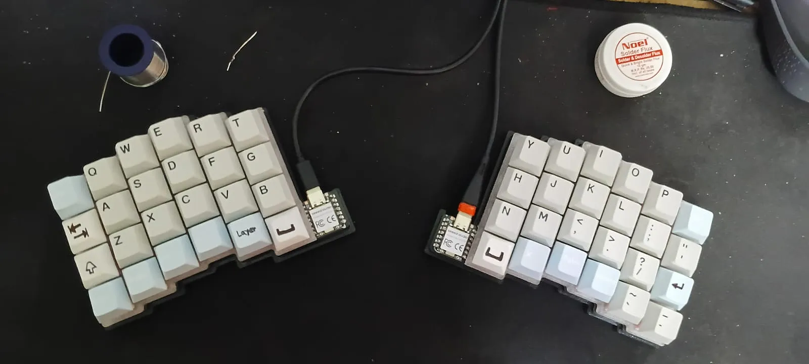
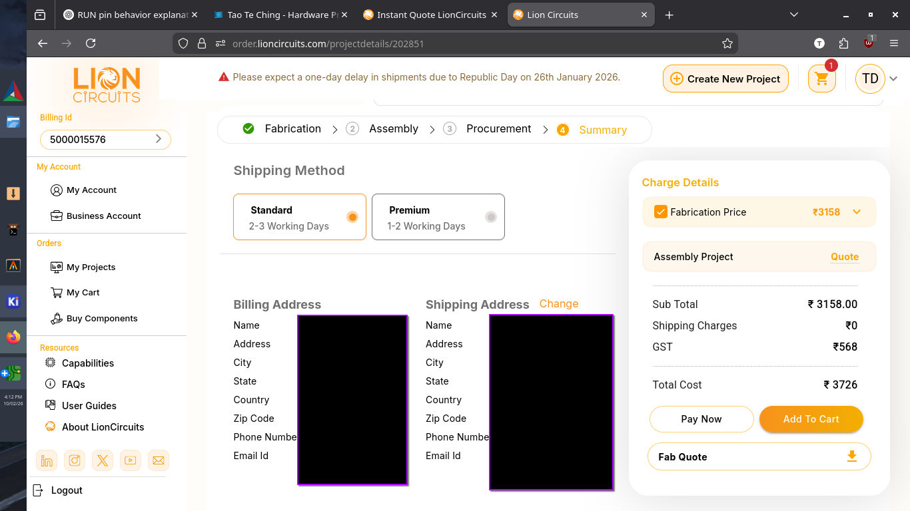

# February 5: Made The Schematic + Keyboard Layout

Made the schematic and finalized the split keeb layout. It’s ortholinear-staggered with wireless support but I’ll be using it wired only. Followed a guide loosely. Parts are placed, wiring left for tomorrow. It’s finally starting to feel like something id use!

The xiao nrf52 is great as it has battery charging in built and also has BLE for longer run time and is compact and has enough GPIO. Also I went with standard mx keys because parts are easily availabe.

> NOTE: later I moved to XIAO rp2040 which is equally as good just without the RF and BLE capabilities.

- SCHEMATIC

- PCB Layout

- KiCAD Render

**Total time spent: 4hour 30minutes**

# February 6: Routed The PCB

Finished routing the PCB today and it honestly went smoother than I expected. Just wired everything up cleanly and it all came together without much headache. Also first project where I didn’t use a ground pour since there weren’t any external power-hungry parts involved, which felt kinda unusual but neat in a way. I do really like that I did not use neopixles as that woulve made me cry while routing.

**Total time spent: 1hour 30minutes**

# February 9: Made The Case

I had to make the case twice because the first version turned out wrong. I realized both sides weren’t properly mirrored.

That meant going back and retracing every line in the DXF used for both the inner and outer parts of the case. A bit tedious, but honestly kind of satisfying in a “fix it properly or suffer later” way.

But in the end it all came together, and I think it looks pretty rad.

**Total time spent: 5hour**

# February 9: Added art to the silkscreen

Added a bit of personality to the PCB today by putting artwork on the silkscreen. This part was honestly really fun. Feels like the “final touch” stage where the board stops being just a project and starts feeling like a finished thing that I can use.

Used KiCad’s image conversion tool to get it done, which made the process pretty smooth.

**Total time spent: 30minutes**

# February 10: Wrote the readme and organized all cart images!

Finished up the project today by writing the README and dusting up all the images for the GitHub page. This was basically the final polish step.

Honestly, I enjoyed every part of this build, schematic to case to silkscreen. It taught me a lot more than I expected going in.

Here’s the final GitHub page:

**Total time spent: 1hour**

# February 23: Added HotSwap Sockets

Saw that most split keyboards use hotswap sockets, so I decided to add them too. Should make the board a lot more flexible and easier to experiment with switches later.

It took some time (and patience), but it was worth it. More soldering, but in a good way.

**Total time spent: 3hour**

# February 26: Ordered All The Parts!

Ran into a small hiccup today — the MCU I originally planned to use, the [XIAO RP2040](https://robu.in/product/seeed-studio-xiao-rp2040-v1-0/), was out of stock 😕. So I switched to the Seeed Studio [XIAO RP2350](https://robu.in/product/seeedstudio-xiao-rp2350-raspberry-pi-rp2350/) instead. Slight change, thanks to the XIAO form factor.

Everything else went pretty smoothly though. I’ve also ordered the prints, but my printer is out of light grey PLA, so I’ll have to wait a bit before those come in.

Other than that… it’s basically all set. Just waiting on parts now.

**Total time spent: 2hour**

# March 12: Fixed Case Height!

The case walls were too shallow, so I couldn’t fit the plate inside properly. Had to go back and redesign both sides to fix the height issue.

A bit annoying, but honestly expected at least one hassle like this. I think I will print this new one.

**Total time spent: 1hour**

# March 14: Got all the items!!

Finally received all the PCBs, which means I’ve got everything needed to start assembly now. Had to pay around $5 in customs -kinda annoying, but not too bad in the grand scheme of things (I once had to give 25usd worth of customs for a devboard that I designed and that did not work.

Everything else looks *near* perfect though.

The only downside is that due to print restrictions I can only get one case print, so the newer revised case design won’t really be usable. Bit of a bummer.

**Total time spent: 1hour 30minutes**

# March 15: Soldered the PCB.

So yeah, I finally got around to soldering the PCB. It took a while because of the number of SMD diodes on each half, and they really slow you down when you’re trying to stay precise. I also ran out of solder midway, so I had to step out and grab more from a local store before continuing.

The diodes were the most time-consuming part each one had to be placed with tweezers, tacked on one side first, then carefully reflowed on the other to keep everything aligned and clean. Slow process, but it kept things neat.

After that I moved on to the hotswap sockets. I aligned each one on its footprint, tinned a single corner pin to lock it in place, and then went back to solder the remaining pins once everything was sitting properly. Much faster than the diodes, but still required attention to avoid any tilt or misalignment.

Except for the solder shortage pause, everything else felt pretty smooth and intuitive once I got into the rhythm.

Here are some pics:

**Total time spent: 5hour 30minutes**

# March 16: Redid the code(had no importance)!! and possibly becoming bald? Soldering the XIAO!

So I had to redo the code today after realizing the previous version just wasn’t working properly. On top of that, I had to troubleshoot the right side since it wasn’t responding at all.

Turns out the issue was way simpler (and more embarrassing) than expected I had literally just pushed the MCU into its place thinking it would work fine like that… spoiler: it didn’t. Took me around 4 hours of confusion and “why is this not working” before I figured that out. :>

This wasnt really a firmware issue but a skill issue!

> ripped my old mouse pad while doing so

Once that was done, I rewrote and cleaned up the KMK script and started to work on the features and stuff. VERY Painful lesson, but a useful one.

  
  
  
  

**Total time spent: 4hour**

# March 16: Revised the readme and added build guide

Cleaned up the README today and added a proper index so you can actually click through sections and files without scrolling forever. Makes the whole repo feel way more structured and usable.

Also added a full build guide mostly for the looks and future-me, because realistically not many people are going to build this exact thing… but it felt right to include anyway.

Now the project feels less like 'a bunch of files' and more like an actual documented build. Which is good!

**Total time spent: 2hour**
